# 03. Entity Relationship Diagram (ERD)

This document visualizes the entity relationship mappings for the **VClick OS** PostgreSQL database schema.

---

## 1. High-Level Entity Relationship Diagram

The following Mermaid diagram maps out the core relationships between tenants, users, pages, blogs, media, taxonomies, forms, redirections, and analytics.

```mermaid
erDiagram
    WEBSITE ||--o{ USER_WEBSITE : "manages"
    USER ||--o{ USER_WEBSITE : "belongs_to"
    
    WEBSITE ||--o{ PAGE : "owns"
    WEBSITE ||--o{ BLOG : "owns"
    WEBSITE ||--o{ MEDIA : "owns"
    WEBSITE ||--o{ CATEGORY : "owns"
    WEBSITE ||--o{ TAG : "owns"
    WEBSITE ||--o{ REDIRECT : "owns"
    WEBSITE ||--o{ LOG_404 : "owns"
    WEBSITE ||--o{ FORM : "owns"
    WEBSITE ||--o{ SERVICE : "owns"
    WEBSITE ||--o{ PORTFOLIO : "owns"
    WEBSITE ||--o{ CASE_STUDY : "owns"
    WEBSITE ||--o{ TESTIMONIAL : "owns"
    WEBSITE ||--o{ FAQ : "owns"
    WEBSITE ||--o{ SETTING : "owns"
    WEBSITE ||--o{ AUDIT_LOG : "owns"
    WEBSITE ||--o{ ANALYTICS_METRIC : "owns"
    WEBSITE ||--o{ TOPIC_CLUSTER : "owns"
    WEBSITE ||--o{ SEMANTIC_ENTITY : "owns"

    USER ||--o{ PAGE : "authors"
    USER ||--o{ BLOG : "authors"
    USER ||--o{ REVISION : "authors"
    USER ||--o{ AUDIT_LOG : "triggers"

    PAGE ||--o{ SCHEMA_BLOCK : "defines"
    PAGE ||--o{ REVISION : "has"
    PAGE }o--|| MEDIA : "has_featured_image"
    PAGE }o--|| MEDIA : "has_social_image"
    PAGE ||--o{ PAGE : "has_parent"

    BLOG ||--o{ SCHEMA_BLOCK : "defines"
    BLOG ||--o{ REVISION : "has"
    BLOG ||--o{ COMMENT : "has"
    BLOG }o--|| MEDIA : "has_featured_image"
    BLOG }o--|| MEDIA : "has_social_image"

    BLOG ||--o{ CATEGORY_BLOG : "has"
    CATEGORY ||--o{ CATEGORY_BLOG : "has"
    CATEGORY ||--o{ CATEGORY : "has_parent"

    BLOG ||--o{ TAG_BLOG : "has"
    TAG ||--o{ TAG_BLOG : "has"

    TOPIC_CLUSTER ||--o{ TOPIC_CLUSTER_SUBPAGE : "defines"

    FORM ||--o{ FORM_SUBMISSION : "captures"
    MENU ||--o{ MENU_ITEM : "defines"
    MENU_ITEM ||--o{ MENU_ITEM : "has_parent"
```

---

## 2. Key Relationship Definitions

1. **Multi-Tenant Scoping (`Website` relation)**:
   - All modules (`Page`, `Blog`, `Media`, `Redirect`, `Log404`, `Setting`, etc.) must link back to a parent `Website` ID. This enables the database adapter layer to easily isolate assets by filtering queries by domain name mapping.
2. **User Tenancy Scoping (`UserWebsite`)**:
   - Rather than giving users broad access, a join table `UserWebsite` handles access mapping. This permits `User` instances to manage multiple sites under one shared login context.
3. **Circular Hierarchies (Self-referential relations)**:
   - `Page` has a one-to-many relationship with itself (`parent` / `children`) to create page nesting.
   - `Category` has a self-reference to construct multi-level nested blog category systems.
   - `MenuItem` contains parent/children self-references to support drop-down navigation.
4. **Asset Tracking**:
   - `Media` relates to `Page` and `Blog` through double optional relationships (`PageFeaturedImage`/`PageSocialImage` and `BlogFeaturedImage`/`BlogSocialImage`). This schema tracking makes it simple for the DAM to alert editors if they attempt to delete a file currently in use.
