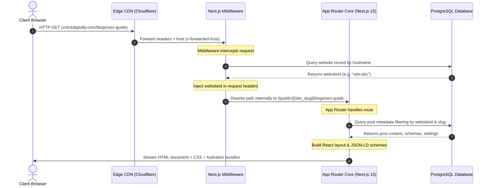
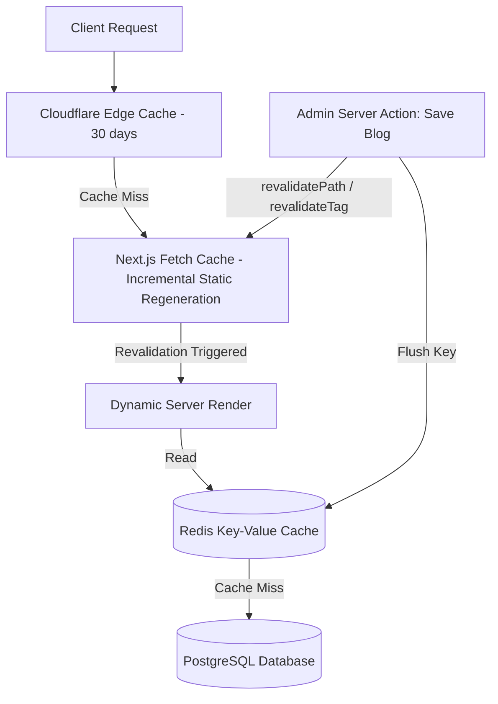

# 04. System Architecture

This document describes the runtime execution, request lifecycle, caching layout, and external API service design for the **VClick OS** platform.

---

## 1. Request Lifecycle & Hostname Routing

VClick OS is a multi-tenant platform serving unlimited domains from a single deployment. Hostname resolution occurs at the Edge Network before hitting Server Components.

### Detailed Middleware Behavior
The Middleware performs three critical functions:
1. **Hostname Rewrite**: Maps the request domain (e.g., `client-site.com`) to the internal route structure (`/(public)/client-site-slug`).
2. **Redirect Evaluation**: Scans the `Redirect` database table for entries matching the requested URL. If a redirect exists, it increments the hits counter and issues an immediate 301/302 redirect before the page rendering lifecycle starts.
3. **404 Interceptor**: If the route does not match any static assets or active database pages/blogs, the middleware intercepts the 404 response, writes the details to the `Log404` table, and serves the tenant-specific custom 404 page.

---

## 2. Component Architecture Split
VClick OS uses React Server Components (RSC) to render the DOM on the server and stream it to the client, utilizing Client Components only where rich UI interaction is required.

- **React Server Components (RSC)**:
  - Base routes: `/admin` dashboard overview, `/admin/pages` tables, and public pages.
  - Performance advantage: Direct access to database resources via Prisma, zero client bundle weight, and secure API keys storage.
- **React Client Components (`"use client"`)**:
  - Interactive layouts: TipTap Rich Text Editor, dynamic SEO Score meters, drag-and-drop Page Builder block panels, and virtual folder asset selectors.
  - Code-splitting: Lazy-loaded dynamically via `next/dynamic` to ensure heavy scripts (such as TipTap extensions or graph renderers) are not loaded on initial page load.

---

## 3. Caching Architecture & Data Invalidation
To support thousands of sites on a single instance, VClick OS implements a multi-layer caching system:

1. **Edge CDN Cache**: Pages are cached at the CDN level. Static routes (e.g., About, Contact) use a stale-while-revalidate model.
2. **Next.js Data Cache**: Queries are cached on the server using `unstable_cache`. 
3. **Cache Keys (Tags)**: Fetch requests are tagged with tenant-specific identifiers (e.g., `tenant:site-abc`, `post:seo-guide`).
4. **On-Demand Invalidation**: When an administrator publishes or updates a page/post via a Server Action, it calls `revalidateTag()`. This immediately purges the cached document across the Next.js runtime and triggers an asynchronous CDN purge webhook.

---

## 4. Digital Asset Processing Pipeline
When an image is uploaded through the media library, it undergoes server-side optimization before being stored:

1. **Unique Identity Verification**: The server generates a SHA-256 hash of the upload. If the hash matches an existing record in the database, the upload is halted, and the editor is prompted to use the existing asset, saving database space.
2. **Sharp Image Conversion**: If the file is a raw JPG/PNG, it is processed via the `sharp` library to:
   - Convert the image to **WebP** and **AVIF** formats.
   - Resize it into responsive widths: `320px`, `640px`, `1024px`, and `1920px`.
   - Compress the sizes by approximately 75% while maintaining image quality.
3. **CDN Upload**: The processed images are uploaded to Cloudflare R2 / AWS S3 storage.
4. **Database Write**: The asset URLs and metadata are recorded in the `Media` table.
