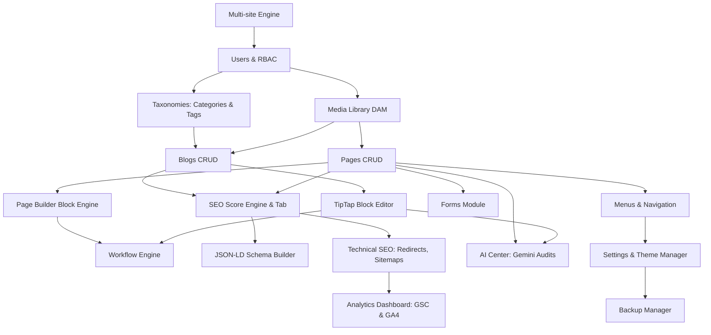

# 05. Feature Dependencies & Module Complexity

This document maps out the system dependencies, estimates development complexity, and outlines the optimal sequence for building the **VClick OS** modules.

---

## 1. Module Complexity Matrix

| Module | Complexity | Justification |
| :--- | :--- | :--- |
| **01. Multi-site Routing Engine** | High | Requires edge headers manipulation, Next.js Middleware path rewriting, and tenant resolution caching. |
| **02. Users & RBAC** | Medium | Standard NextAuth credentials setup, but requires scoping users to websites via a join table. |
| **03. Pages Module** | Medium | Simple hierarchical CRUD database structures, but integrates nested page listings and slug generation. |
| **04. Blogs Module** | Medium | Relies on relational taxonomy mapping (categories/tags) and authors links. |
| **05. Media Library (DAM)** | High | Involves direct-to-S3 signed uploads, local `sharp` image conversions, alt tags metadata, and file hash generation. |
| **06. Workflow Engine** | Medium | Enforces state-machine updates for post statuses with security hooks. |
| **07. Page Builder** | Very High | Requires serializing a layout system into JSON, generating dynamic React components from blocks, and managing assets. |
| **08. TipTap Block Editor** | High | Standard editor configurations, but requires custom extensions for FAQs, CTAs, and comparison tables. |
| **09. SEO Score Engine** | Very High | Demands content parsing, real-time client canvas pixel-width checks, and structured checklist scoring. |
| **10. Schema Builder** | High | Generates variable JSON-LD schemas based on custom schema forms. |
| **11. Technical SEO Dashboard**| High | Involves middleware redirect interception, 404 monitoring tables, XML sitemaps, and robots.txt generation. |
| **12. AI Center** | High | Involves formatting prompts for Gemini, content audits, Vision alt text suggestions, and entity suggestions. |
| **13. Forms Module** | High | Drag-and-drop forms layout builder and dynamic submissions parsing. |
| **14. Navigation Menus** | Medium | Standard hierarchical nesting layout. |
| **15. Analytics Dashboard** | High | Google OAuth credentials handling, fetching GSC/GA4 API records, and rendering charts. |
| **16. Integrations** | Medium | Configuration manager for tracking tags and API credentials. |
| **17. Backup Manager** | Medium | Simple cron-based DB backup uploads to S3. |
| **18. Theme Manager** | Medium | CSS variable tokens configuration page. |

---

## 2. Dependency Architecture Map

The following dependency graph shows the required build order for VClick OS. Modules at the top must be completed before those below them can be built.

---

## 3. Optimal Implementation Order & Rationale

1. **Step 1: Multi-site Engine & DB Setup**:
   - Establish the database connection and the hostname-rewriting middleware first. All subsequent data models require a valid `websiteId` scope.
2. **Step 2: Users & RBAC**:
   - Configure Auth.js authentication and role checking. This secures the `/admin` routes.
3. **Step 3: Media Library (DAM)**:
   - Build file uploading and optimization early. Pages, blog posts, and portfolios require a media manager to select and link featured images.
4. **Step 4: Taxonomies & Content CRUD (Pages, Blogs)**:
   - Implement the core pages and blog posts database CRUD.
5. **Step 5: TipTap & Page Builder Blocks**:
   - Introduce rich editing interfaces once the basic post saves work.
6. **Step 6: Workflow Engine**:
   - Apply publishing state checks to content updates.
7. **Step 7: SEO Engine & Schema Builder**:
   - Integrate SEO meta fields, checklist validation, and JSON-LD schema generation into the Page and Blog editing workspaces.
8. **Step 8: Technical SEO & Redirects**:
   - Implement the redirect manager middleware, XML sitemap generation, and 404 monitors.
9. **Step 9: AI Center**:
   - Hook up Google Gemini APIs to optimize metadata, alt descriptions, and schemas.
10. **Step 10: Integrations, Analytics, Forms, Menus**:
    - Connect GA4/GSC reporting and build frontend navigation controllers.
11. **Step 11: Theme Manager & Backup Manager**:
    - Add customization options and automated database backup configurations.
