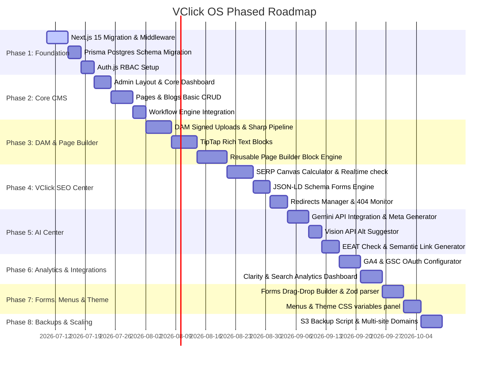

# 06. Implementation Roadmap

This document outlines the phased roadmap for building **VClick OS**. Each phase represents a group of deliverables with clear validation points before moving to the next.

---

## 1. Development Phases

---

## 2. Phase Detail & Key Deliverables

### Phase 1: Foundation (MVP)
- **Goal**: Migrate the existing Vite application structure to Next.js 15 App Router, configure multi-site database scoping, and set up user authentication.
- **Deliverables**:
  - Restructured folder layout inside `Vclick`.
  - Next.js Edge Middleware detecting hostnames and rewriting routes.
  - Active Prisma PostgreSQL database schema containing roles and tenancy tables.
  - Auth.js authentication provider defending the `/admin` routes.
- **Validation**: Verify that trying to access `/admin` redirects unauthorized users to `/admin/login`.

### Phase 2: Core CMS (MVP)
- **Goal**: Build base-level management dashboards and standard page editing workflows.
- **Deliverables**:
  - Dark brutalist dashboard sidebar, layout panels, and top bar.
  - Hierarchical Page and Blog lists with status filtering.
  - Content editing pages supporting custom slug generation.
  - State machine workflow rules (`DRAFT` -> `PUBLISHED` -> `ARCHIVED`).
- **Validation**: Create a new page, save as draft, view in listings table, progress its workflow status, and verify publication.

### Phase 3: Media Library (DAM) & Editor Blocks (v1.0)
- **Goal**: Integrate file uploading and custom content block editing.
- **Deliverables**:
  - Media Drag-and-drop dashboard.
  - Sharp optimization pipeline outputting AVIF/WebP variants and responsive layout image sets.
  - TipTap block editor with custom components (Comparison tables, FAQ accordions, alerts).
  - Drag-and-drop Page Builder block assembler.
- **Validation**: Upload a 5MB JPG file, verify it compiles into WebP/AVIF versions under 200KB, insert the optimized image into a page layout block, and inspect rendering.

### Phase 4: VClick SEO Center (v1.0 / v2.0)
- **Goal**: Implement standard-beating SEO validation tools.
- **Deliverables**:
  - SEO tab component integrated into editors.
  - Canvas-based title and meta description pixel-width calculators.
  - Real-time on-page SEO checklist analyzer.
  - Redirect manager middleware (with automatic suggestion logs).
  - Dynamic XML sitemaps and robots.txt generation.
- **Validation**: In page editor, input a title exceeding 600px width. Confirm the visual warning displays in real time and verify generated sitemaps compile correctly at `/sitemap.xml`.

### Phase 5: AI Center (v2.0)
- **Goal**: Integrate Gemini AI to automate content optimization tasks.
- **Deliverables**:
  - Meta metadata generators.
  - Vision API alt tag description suggetor.
  - AI schema generator and content quality (EEAT) check list parser.
- **Validation**: Click "Auto-Generate Alt" on an image upload. Verify that the Gemini API returns a descriptive, keyword-rich alternative text.

### Phase 6: Analytics & Integrations (Enterprise)
- **Goal**: Connect external telemetry services directly to the CMS dashboard.
- **Deliverables**:
  - Google OAuth credential loader.
  - Search Console impressions/clicks metrics displays.
  - GA4 traffic dashboards.
  - Index coverage and 404 crawl issue reports.
- **Validation**: View the `/admin/seo-center` dashboard and check GSC traffic charts rendering data fetched from Google APIs.

### Phase 7: Forms, Navigation & Styling (Enterprise)
- **Goal**: Build lead collection pipelines and customize styling.
- **Deliverables**:
  - Forms constructor and submissions viewer.
  - Menu nesting manager.
  - Theme variable loader page.
- **Validation**: Build a contact form in the editor, submit a test query on the front-end, and verify it populates the admin forms dashboard.

### Phase 8: Backups & Scaling (Enterprise)
- **Goal**: Maintain platform stability and data safety.
- **Deliverables**:
  - Backup scheduler.
  - Subdomain routing controllers.
- **Validation**: Run backup command and verify the compressed database file is stored in S3/R2 storage.
