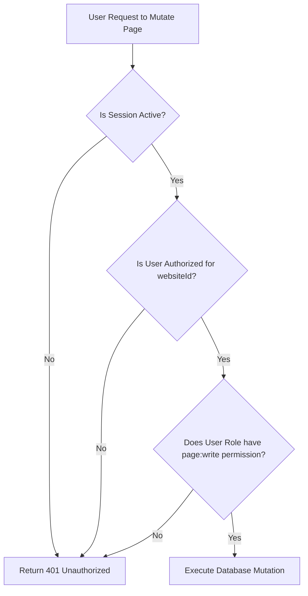

# 09. Security & Access Control

This document specifies the security controls, validation processes, and rate-limiting configurations implemented in **VClick OS**.

---

## 1. Authentication & Role-Based Access Control (RBAC)

Authentication is handled by **Auth.js (v5)** using a credentials-based login flow.

### Access Control Architecture
VClick OS uses a granular permissions system. A user's access is restricted to their assigned roles and the specific tenant websites they are authorized to manage:



### Predefined Roles & Permissions Scopes
Permissions are defined as string values (e.g. `pages:publish`, `media:delete`) and mapped to roles:

- **SUPERADMIN**: Global access across all client sites and settings. The only role authorized to manage websites or allocate admin accounts.
- **ADMIN**: Access to a specific tenant's settings, users, and content databases.
- **EDITOR**: Authorized to write, edit, and publish content (Pages, Blogs, Services, Portfolios, Case Studies).
- **AUTHOR**: Authorized to write and edit their own articles. Cannot publish changes without review or delete content.
- **CONTRIBUTOR**: Authorized to write drafts. Cannot publish content or upload media without review.

---

## 2. Platform Security Protections

### XSS (Cross-Site Scripting) Prevention
Because the TipTap editor processes rich HTML input, all markup must be sanitized to prevent malicious script injection.
- **Sanitization Pipeline**:
  - The client sanitizes HTML inputs before submission.
  - The server applies **Isomorphic DOMPurify** inside Server Actions to parse and sanitize HTML before it is saved to the database.
  - Public pages render content using Next.js safe template tags. Safe rendering is only used for sanitized HTML fields, and is never applied directly to raw query variables.

### CSRF (Cross-Site Request Forgery) Prevention
Next.js Server Actions include built-in protection against CSRF attacks. 
- Next.js matches the request origin against the host header.
- During session authentication, Auth.js enforces secure cookie policies (`SameSite: Lax` or `SameSite: Strict`).

### SQL Injection Protection
All database queries in VClick OS are executed via **Prisma ORM**. 
- Prisma automatically parameterizes SQL statements, preventing SQL injection attacks.
- Direct database calls (`$queryRaw`) are strictly prohibited unless parameter inputs are explicitly validated and bound to typed parameters.

---

## 3. API Rate Limiting (Token Bucket Algorithm)
To defend against Brute Force attacks and API spam, rate limiting is implemented on the `/admin/login` and `/api/forms/submit` endpoints:

- **Algorithm**: Token Bucket.
- **Implementation**:
  - A Redis instance (e.g., Upstash) tracks user IP addresses and request frequencies.
  - **Login Route limits**: Max 5 attempts per IP address every 15 minutes.
  - **Form Submissions limits**: Max 10 submits per IP address every 1 hour.
- **Response**: Exceeding rate limits returns an HTTP `429 Too Many Requests` status code.

---

## 4. Security Audit Logging

All state modifications in the administration dashboard are logged to the `AuditLog` table:

```typescript
interface AuditLogPayload {
  websiteId: string;
  userId: string;
  action: string;      // E.g. "USER_LOGIN_SUCCESS", "PAGE_PUBLISH", "REDIRECT_DELETE"
  details: string;     // JSON string describing mutated values (excluding passwords/keys)
  ipAddress: string;   // Hashed or sanitized IP address for privacy compliance
}
```
Audit logs are read-only and cannot be updated or deleted through the administration panel.
