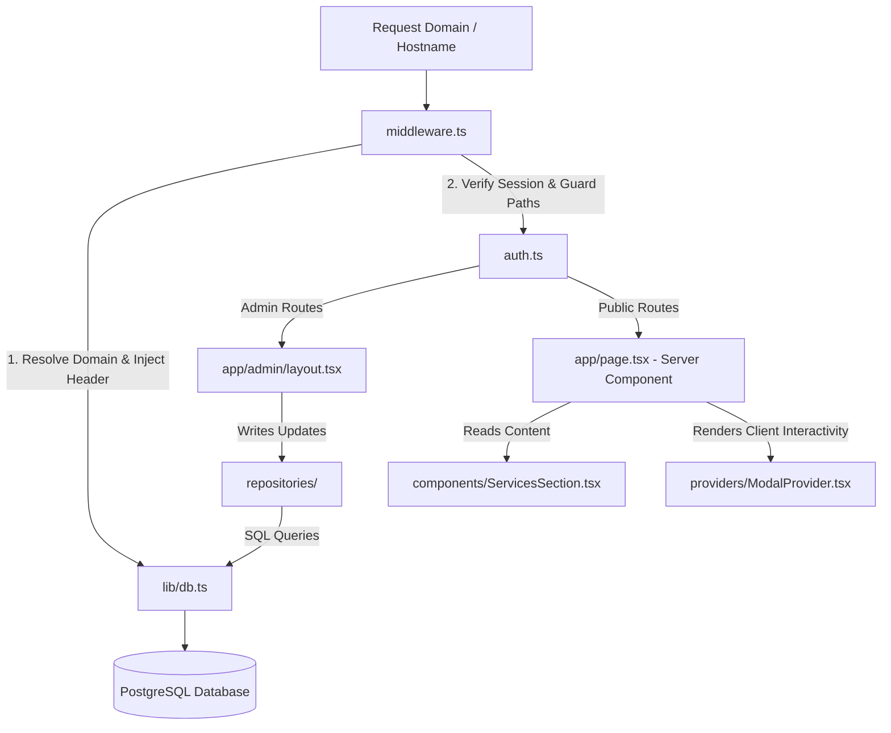

# VClick CMS - Master Architecture Document

Welcome to the **VClick CMS** single source of truth. This master document outlines the platform-wide engineering guidelines, overall architecture, directory structures, development phases, and integration schemas.

---

## 1. Directory Structure

The platform adopts a clean, feature-driven architecture separating public routes, CMS modules, and database adapters:

```text
src/
├── app/                           # Next.js App Router Pages & Layouts
│   ├── api/                       # API Handler endpoints (Auth, submissions)
│   ├── admin/                     # Admin Console Layouts, logins, dashboards
│   ├── loading.tsx                # Dynamic page loading boundary
│   ├── error.tsx                  # Client-side route-level boundary
│   ├── global-error.tsx           # Ultimate fallback layout boundary
│   ├── not-found.tsx              # Custom 404 page styled in dark brutalism
│   ├── robots.ts                  # Dynamic crawler robot rules
│   ├── sitemap.ts                 # Dynamic XML sitemap generator
│   ├── manifest.ts                # Web app progressive manifest
│   └── page.tsx                   # Public homepage (RSC Component)
├── components/
│   ├── ui/                        # Low-level UI primitives (design design primitives)
│   ├── shared/                    # Cross-feature widgets (e.g. state badges, indicators)
│   └── layout/                    # Layout items (Header, Sidebar, Client-side modals)
├── config/                        # System configurations (Google fonts, site configuration)
│   ├── fonts.ts                   # next/font/google local and web fonts configuration
│   ├── site.ts                    # Tenant site configuration and social tags
│   ├── cms.ts                     # Feature toggles (AI Center, analytics)
│   └── navigation.ts              # Links collections for header, footers, sidebars
├── constants/                     # Immutable configuration constants
│   ├── roles.ts                   # Administrative system user roles list
│   ├── permissions.ts             # Static security permission matrices
│   ├── routes.ts                  # App Router path string declarations
│   └── seo.ts                     # Pixel limit constants & Google validation schemas
├── providers/                     # React context wrappers
│   ├── AppProviders.tsx           # Combined provider aggregator (Session, Theme, Toast)
│   ├── ThemeProvider.tsx          # Color modes manager
│   ├── ToastProvider.tsx          # System success/error notification overlays
│   └── ModalProvider.tsx          # Client-side modal open/close states manager
├── auth/                          # Isolated Authentication Module
│   ├── config.ts                  # NextAuth configurations (JWT callbacks, page limits)
│   ├── providers.ts               # Login providers (Credentials, Google, MS, Github)
│   ├── session.ts                 # NextAuth instance & IAuthService abstraction
│   ├── permissions.ts             # Type-safe user roles & policy matrix
│   └── middleware.ts              # Modular administrative route guard middleware
├── modules/                       # Reusable CMS Module packages
│   ├── pages/                     # Page management
│   ├── blogs/                     # Blogs management
│   ├── seo/                       # SEO Center
│   └── media/                     # Media DAM
├── lib/                           # Central system utility scripts
│   ├── db.ts                      # Prisma client connection and caching
│   ├── logger.ts                  # Abstract logging interface and console logger
│   └── env.ts                     # Zod-backed environment verification
├── hooks/                         # Global React client hooks
├── services/                      # Third-party integrations (Gemini, Mailtrap, GA4)
├── repositories/                  # Isolated database querying layer
├── types/                         # Shared typescript interfaces
└── utils/                         # Global helper functions
```

---

## 2. Platform Architecture Map



---

## 3. Reference Specifications Index

For granular detail on specific system blocks, refer to these standalone documents:

1. **[01 Product Specification](file:///c:/Users/DELL/OneDrive/Desktop/Vclick/Vclick/docs/01_PRODUCT_SPECIFICATION.md)**: Dynamic modular functional specifications (SEO Center, Pages, Blogs, AI features).
2. **[02 Database Design](file:///c:/Users/DELL/OneDrive/Desktop/Vclick/Vclick/docs/02_DATABASE_DESIGN.md)**: Complete database entity schemas mapped for multi-site partitioning.
3. **[03 Entity Relationship Diagram (ERD)](file:///c:/Users/DELL/OneDrive/Desktop/Vclick/Vclick/docs/03_ERD.md)**: Visual connections mapping of cascading relationships.
4. **[04 System Architecture](file:///c:/Users/DELL/OneDrive/Desktop/Vclick/Vclick/docs/04_SYSTEM_ARCHITECTURE.md)**: Deep dive into request life cycles, edge middleware, caching, and server vs client allocations.
5. **[05 Feature Dependencies](file:///c:/Users/DELL/OneDrive/Desktop/Vclick/Vclick/docs/05_FEATURE_DEPENDENCIES.md)**: Tree mapping of feature dependencies to ensure modules can be compiled independently.
6. **[06 Release Roadmap](file:///c:/Users/DELL/OneDrive/Desktop/Vclick/Vclick/docs/06_ROADMAP.md)**: Chronological checklist detailing the 10 engineering stages.
7. **[07 Admin Console UI Design](file:///c:/Users/DELL/OneDrive/Desktop/Vclick/Vclick/docs/07_ADMIN_UI.md)**: User Experience design tokens, dark brutalism specs, and sidebar layouts.
8. **[08 API Endpoint Schema](file:///c:/Users/DELL/OneDrive/Desktop/Vclick/Vclick/docs/08_API_DESIGN.md)**: Endpoint signatures, request-response layouts, and status code standards.
9. **[09 Security Protocol Manual](file:///c:/Users/DELL/OneDrive/Desktop/Vclick/Vclick/docs/09_SECURITY.md)**: Authentication standards, CSRF protections, and route protection matrices.
10. **[10 Deployment Blueprint](file:///c:/Users/DELL/OneDrive/Desktop/Vclick/Vclick/docs/10_DEPLOYMENT.md)**: CI/CD configuration pipelines, Vercel edge setups, database pooling, and performance verification.

---

## 4. Development Phases Summary
- **Phase 1: Project Foundation & Security** (Complete): Environment security, database schema setup, Auth.js credentials, and base admin interface.
- **Phase 1.5: Foundation Refactoring & Production Readiness** (Complete): RSC Homepage architecture, App Router native file handlers, centralized site fonts, logging engines, and metadata configurations.
- **Phase 2: Core Dashboard & Tenant site Manager** (Next): Analytics charts, site options settings, user administration, and media assets upload buckets.

---

## 5. Coding & Dependency Rules
1. **RSCs by Default**: Keep pages, headers, and footer blocks as Server Components. Isolate stateful features (toggles, slideshows, modals) to Client Components (`"use client"`).
2. **Abstract Logging**: Invoke the generalized logging interface (`src/lib/logger.ts`) instead of importing third-party engines directly inside business logic files.
3. **Decoupled Database Repositories**: Pages and Server Actions must query database models through the `repositories/` layer rather than making direct Prisma queries.
4. **Tailwind Styling Integrity**: Build UI details using global variables matching the colors and animations tokens defined in `src/config/theme.ts`.
5. **Open Source Only**: Avoid proprietary external SaaS tools. Keep dependencies lightweight and easily upgradeable.
