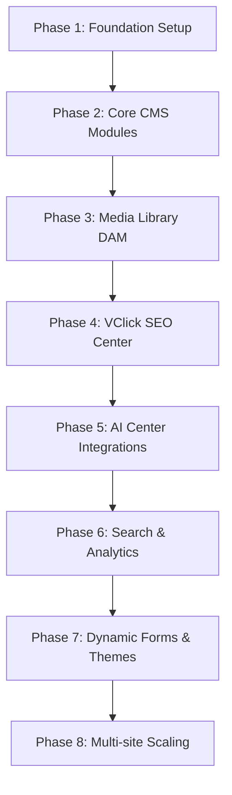

# VClick OS Technical Documentation

Welcome to the enterprise product specification and software architecture documentation for **VClick OS** (Enterprise AI-Powered CMS & SEO Platform).

---

## Central Authoritative Reference

*   **[MASTER ARCHITECTURE SPECIFICATION](file:///c:/Users/DELL/OneDrive/Desktop/Vclick/Vclick/docs/MASTER_ARCHITECTURE.md)**: The single source of truth describing folder structures, coding standards, modular dependencies, and overall platform request mapping.

---

## Document Index

1. **[01. Product Specification](file:///c:/Users/DELL/OneDrive/Desktop/Vclick/Vclick/docs/01_PRODUCT_SPECIFICATION.md)**
   - High-level business vision, target audience, 23 enterprise modules list, Page Builder, Workflow state transitions, and tiering categorizations (MVP, v1.0, v2.0, Enterprise).
   
2. **[02. Database Design & Prisma Schema](file:///c:/Users/DELL/OneDrive/Desktop/Vclick/Vclick/docs/02_DATABASE_DESIGN.md)**
   - Detailed PostgreSQL tables definitions using Prisma Schema syntax, index structures, composite unique constraints, and foreign key rules.
   
3. **[03. Entity Relationship Diagram (ERD)](file:///c:/Users/DELL/OneDrive/Desktop/Vclick/Vclick/docs/03_ERD.md)**
   - A visual system graph mapping out 1-to-many, optional, and self-referential relationships using Mermaid.
   
4. **[04. System Architecture](file:///c:/Users/DELL/OneDrive/Desktop/Vclick/Vclick/docs/04_SYSTEM_ARCHITECTURE.md)**
   - Request lifecycle, edge domain resolution middleware, server vs. client code splitting, multi-layered caching invalidation flow, and sharp file processing.
   
5. **[05. Feature Dependencies & Module Complexity](file:///c:/Users/DELL/OneDrive/Desktop/Vclick/Vclick/docs/05_FEATURE_DEPENDENCIES.md)**
   - Matrix mapping module complexity (Low to Very High), implementation dependency trees, and critical path analysis.
   
6. **[06. Implementation Roadmap](file:///c:/Users/DELL/OneDrive/Desktop/Vclick/Vclick/docs/06_ROADMAP.md)**
   - An 8-phase roadmap tracking foundation build, core CMS, DAM, SEO validations, AI helper integrations, analytics widgets, form builders, and multi-site scaling.
   
7. **[07. Admin UI & UX Design](file:///c:/Users/DELL/OneDrive/Desktop/Vclick/Vclick/docs/07_ADMIN_UI.md)**
   - Luxury Dark Brutalism CSS theme variable tokens, global administration sidebar grids, and wireframe layouts.
   
8. **[08. API Design & Server Actions](file:///c:/Users/DELL/OneDrive/Desktop/Vclick/Vclick/docs/08_API_DESIGN.md)**
   - Next.js Server Actions signatures, REST API dynamic routes (XML Sitemap, Image Sitemap, robots.txt), and JSON request payload blocks.
   
9. **[09. Security & Access Control](file:///c:/Users/DELL/OneDrive/Desktop/Vclick/Vclick/docs/09_SECURITY.md)**
   - Credentials provider auth policies, RBAC user-website scoped validation grids, XSS/CSRF/SQL injection sanitizers, and token-bucket API rate limits.
   
10. **[10. Deployment & Hosting Strategy](file:///c:/Users/DELL/OneDrive/Desktop/Vclick/Vclick/docs/10_DEPLOYMENT.md)**
    - Serverless edge environments (Vercel) vs. self-hosted containers (Docker), PgBouncer connection pool sizing, and pg_dump S3 backup script crons.

---

## Optimal Implementation Path

